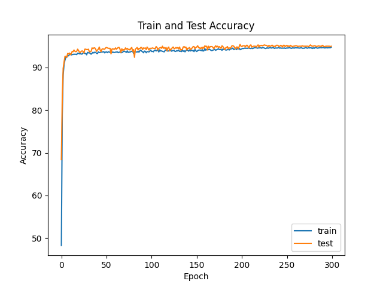
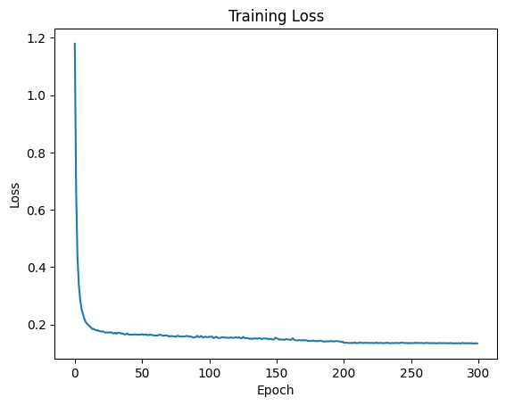

# Classification

This directory considers many machine learning models for air quality classification. Logistic regression performs rather well, but struggles with poor and hazardous categories. SVM performs better, however, random forest and XGBoost both perform very well (and almost exactly the same).

---

## Files

### LogisticRegression.py
Fits a logistic regression model to the air quality data. Population density was excluded as an input in the final model since its p-value did not pass the significance threshold for any of the categories of air quality.

### SVM_linear.py
Fits a linear SVM to the air quality data using a 5 fold cross validation to tune the cost parameter "C".

### RandomForest.py
Fits a random forest classifier to the air quality data using a 5 fold cross validation tuning the number of trees, minimum samples per leaf, and number of inputs allowed at each input. A randomized grid search is used to increase computational efficiency.

### XGBoost.py
Fits an XGBoost classifier to the air quality data with 5 fold cross validation used to tune the number of trees, max depth, learning rate, minimum child weight, and gamma hyperparameters. A randomized grid search is used.

### NeuralNetworkModel.py
Contains classes for a pytorch dataset and a class for the basic neural network used for classification in NeuralNetwork.py

### NeuralNetwork.py
Trains a neural network for multi-class classification of air quality data using pytorch. The model contains one hidden layer with 5 nodes and shows comparable performance to the other models achieving a 95% test accuracy in 300 epochs. A learning rate decay is applied at 200 epochs to prevent high variablity in test accuracy and to fine tune parameters.

Loss and Accuracy by epoch

