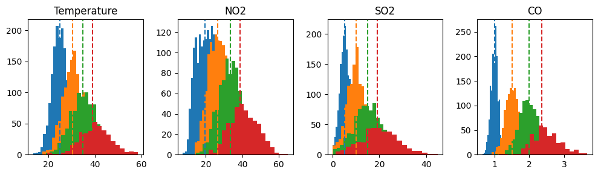
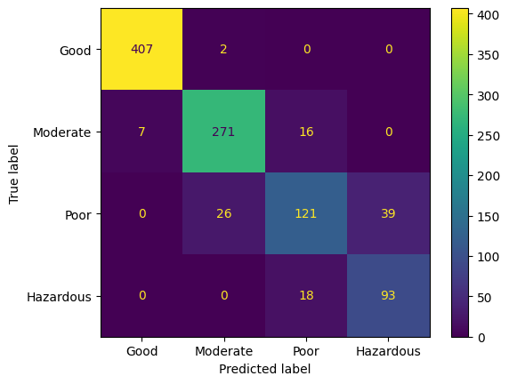

# Clustering
This subdirectory covers the use of clustering to separate out each group of air quality using unsupervised learning. Due to separate gaussian distributions found for each of the different classes of air quality in certain variables (see EDA), a gaussian mixture model was used to cluster the observations.

## gmm.py
This file uses the gaussian mixture model to cluster the observations in four different groups, one for each class. The data is clustered using the CO, temperature, SO2, and NO2 inputs. Results show that the gmm finds the correct cluster means for each variable and accurately clusters the observations into different classes of air quality. While having slightly worse performance than most models in the "Classification" subdirectory (excluding logistic regression), the model shows to very accurately place test observations into the correct cluster for the correct air quality category without actually directly learning the relationship between the input variables and the target air quality.

