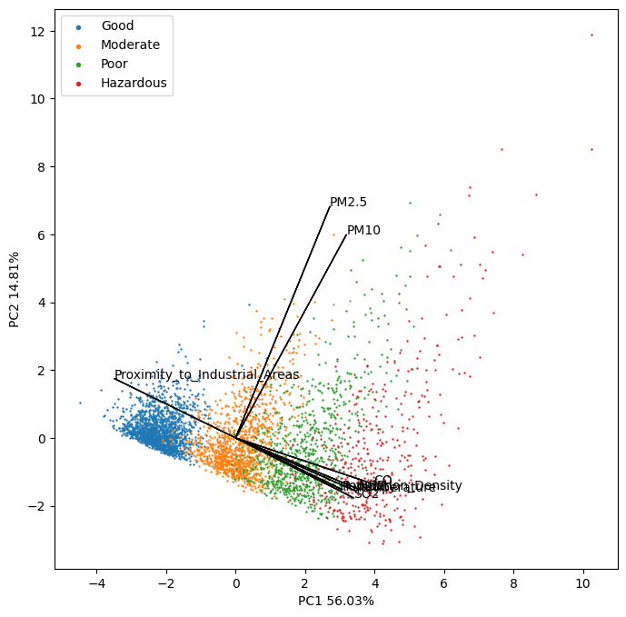

# EDA

This directory contains code for the exploratory data analysis in this project.

---

## Files
### clean_data.py
Replaces missing values with the means of the variables. Not much to clean.

---

### Plot_Variable_Distributions.py
Creates plots of histograms for each input variable, all split into 4 distributions for the different classes of air quality. Also creates pair plots to show correlations between input variables and a correlation matrix. The histograms for Temperature, CO, NO2, and SO2 show different normal distributions for each category of air quality, demonstrating that the different air quality categories may be clustered using a gaussian mixture model on these four variables.

---

### PCA.py
Performs a PCA decomposition on the input data and plots a scree plot, PC1 vs PC2 scatter, and histograms for the PCs. PC1 and PC2 similarly show different normal distributions for each air quality category and in addition show rather good separability between classes. The first two PCs account for 56% and 14.8% of the variability in the data (~70% combined).

