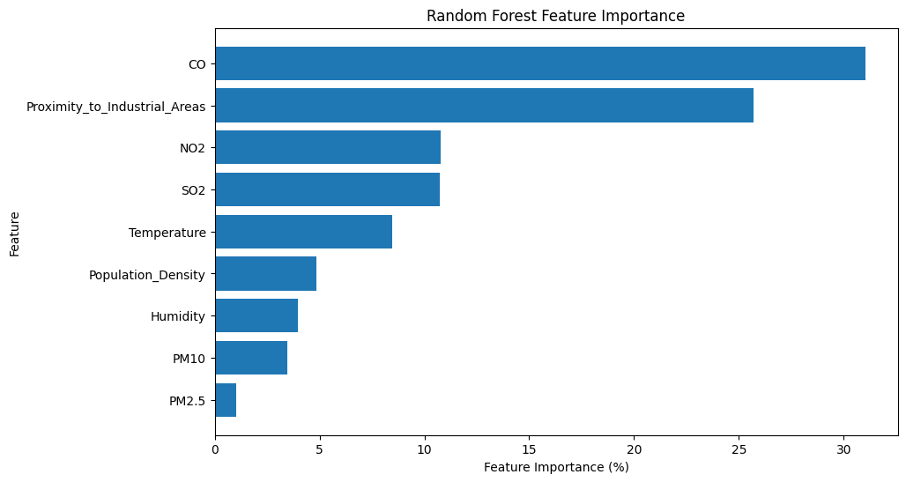
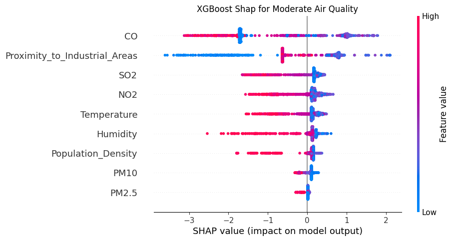

# XAI

## Random Forest
The random forest and how the model uses the input features is explored through the Random Forest feature importance metric, permutation importance, and shapley values. The feature importance and permutation importance for the random forest agree quite well with the exception of feature importance putting population density above humidity and permutation importance the opposite. In addition, permutation importance shows very negligible values for PM2.5 and PM10, so they may not be necessary for the model. Shap shows how each of the inputs affects how a point is classified with one plot for each class. Positive shap values means the class is more likely to be predicted and negative means less likely.

## XGBoost
Similarly to random forest, feature importance (Gain in predictive capability), permutation importance, and shap values are used in XGBoost. Feature importance and permutation importance here are somewhat similar to random forest, however proximity to industrial areas has higher permutation importance than CO and humidity is higher than SO2 in permutation importance. Shap values for different classes are provided as well.

